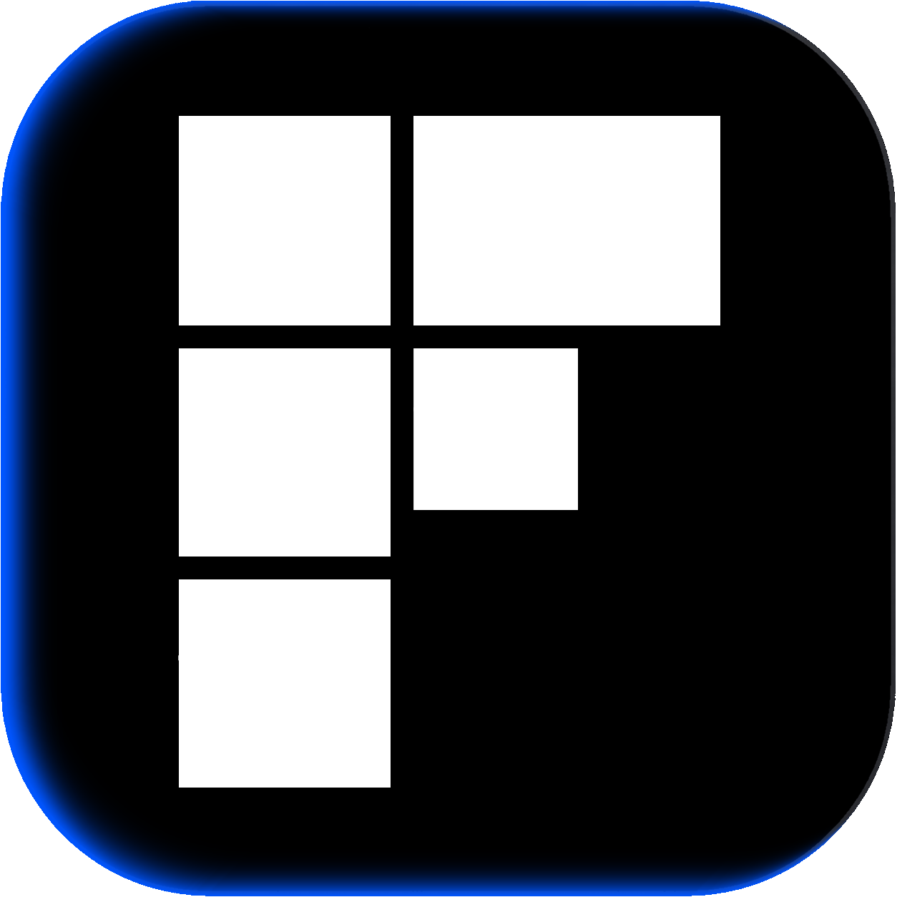

  
  <h1>Fleck</h1>

  

    
    
    
  

Fleck is an open-source, cross-platform raster image editor.

It provides a flexible workspace for editing images, arranging assets, and exporting specific regions of the canvas.

## Overview

Fleck combines traditional raster editing with named export areas.

You can place images on a workspace, edit pixels directly, create export regions, and export those regions in different formats and sizes.

## Core features

- Raster image editing
- Infinite workspace
- Layers
- Selections
- Pixel editing
- Text and shapes
- Background removal
- Named export areas
- Multiple outputs per export area
- Icon and favicon exports
- Batch exports
- Command palette

## Export areas

Export areas are named regions of the workspace.

Each export area can define its own output settings, including size, format, padding, background, filename, and export path.

A workspace can contain multiple export areas.

## File format

Fleck workspaces are saved as `.fleck` files.

A workspace stores the canvas, layers, source images, export areas, output settings, and document metadata.

## Status

Fleck is currently in development.

## License

Fleck is licensed under the MIT License.
